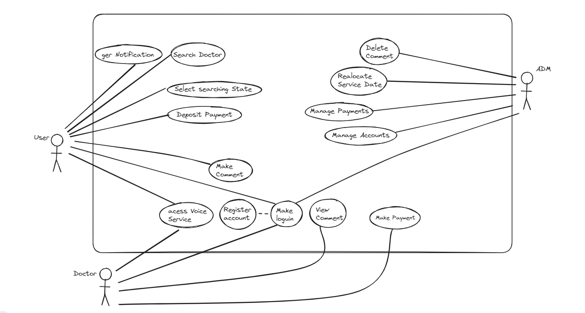
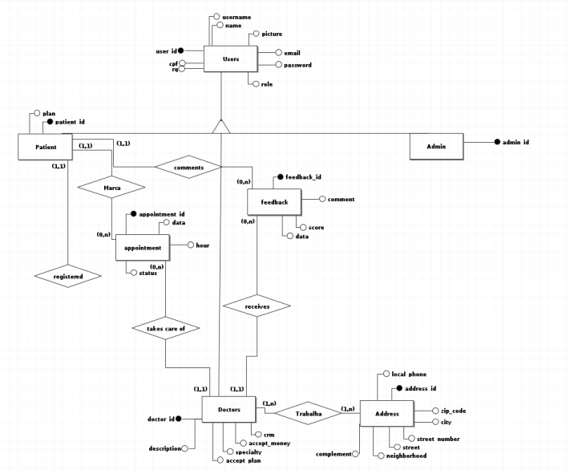
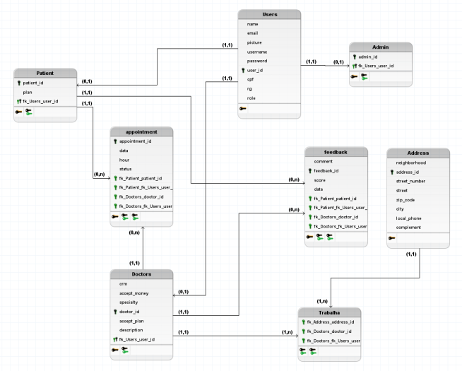

Diagrama de Casos:

Banco de Dados:

Descrição do Projeto:

Doctor Finder PE é uma plataforma dedicada a conectar pacientes com os especialistas adequados. Os usuários, após cadastro em nosso site, têm acesso a um amplo catálogo de médicos registrados. A busca pode ser filtrada por localidade e especialidade, facilitando a escolha do profissional mais próximo e apropriado. Além disso, o sistema oferece funcionalidades de avaliação, comentários e agendamento de consultas, permitindo feedback dos pacientes e gerenciamento de agendas tanto para médicos quanto para pacientes.
